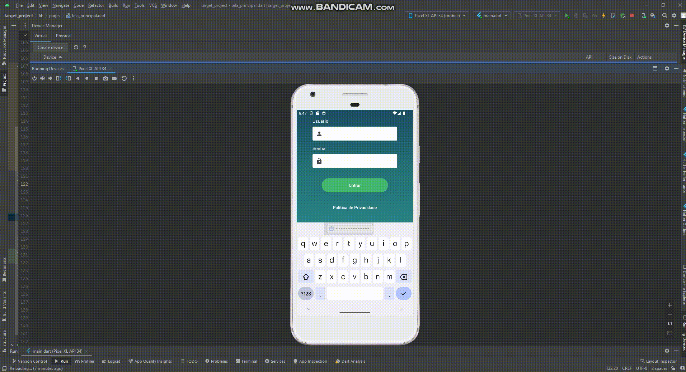

<h1 align="center">Target_project</h1>

Projeto desenvolvimento em flutter e dart com a utilização de mobx

<h1 align="center">
   🔗 Flutter
</h1>

 🚀 framework utilziado para construir interfaces do usuário com componentes reutilizáveis

<h4 align="center"> 
	  Target Project 🚀 Concluido
</h4>

  

